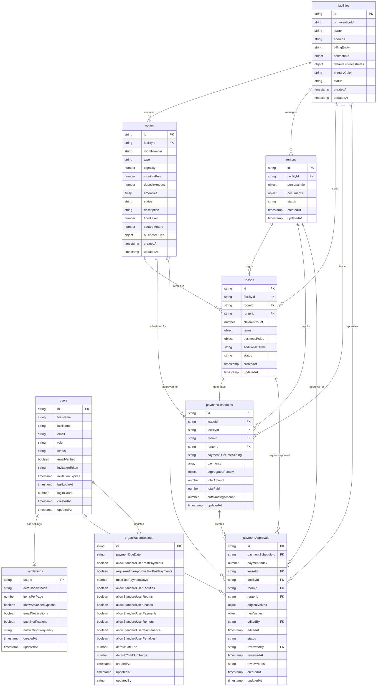

# Database Entity Relationship Diagram

## Overview
This Mermaid diagram shows the relationships between all collections in the Rental Management System database.

## Mermaid ERD Diagram

## Key Relationships

### Core Business Entities
- **Facilities** are the top-level entities that contain **Rooms** and manage **Renters**
- **Rooms** are rented by **Renters** through **Leases**
- **Leases** generate **Payment Schedules** automatically

### Payment Flow
- **Payment Schedules** contain individual payment records
- **Payment Approvals** are created when payment modifications need review
- **Users** can edit payments and approve modifications

### User Management
- **Users** have personal **User Settings** for UI preferences
- **Organization Settings** control system-wide permissions
- **Users** update organization settings and review payment approvals

### Data Integrity
- All entities maintain audit trails with `createdAt` and `updatedAt` timestamps
- Foreign key relationships ensure data consistency
- Business rules are inherited from facility to room to lease level
